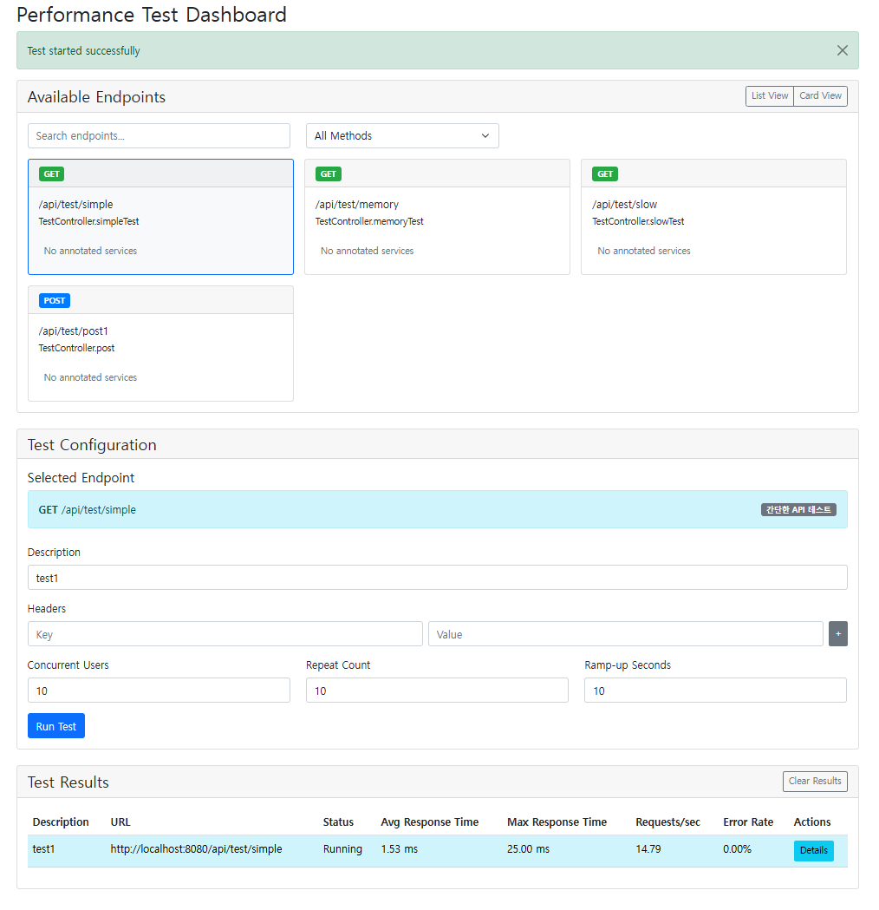
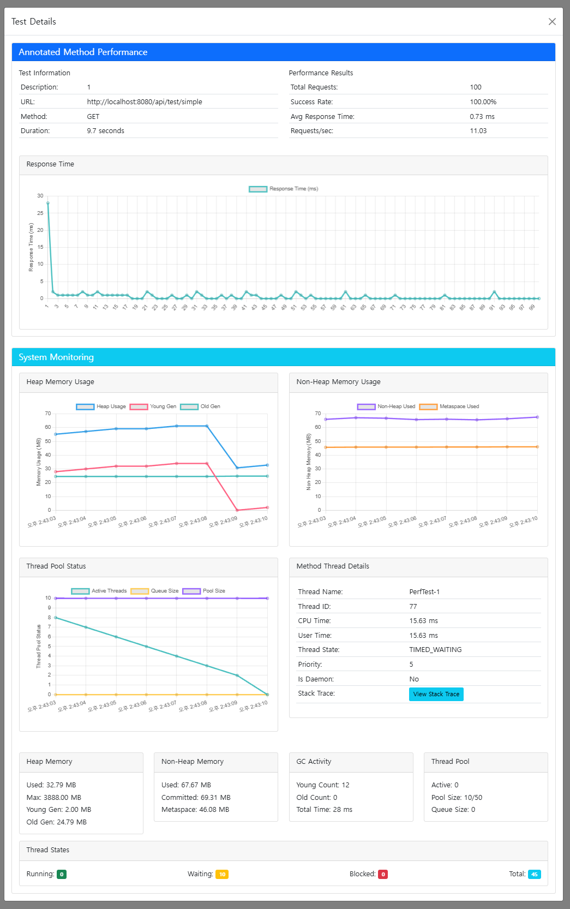

# SSPMA (Simple-Spring-Performance-Measuring-Annotation)

A Spring Boot performance testing and monitoring tool that can be easily used with a single annotation. It provides real-time monitoring through WebSocket communication, memory tracking, and detailed thread analysis.

<p>
  
  
</p>

</br>

## Features
### 1. Real-time Performance Monitoring
- Memory Usage Tracking (Heap, Non-Heap)
- Thread Pool Metrics (Active, Pool Size, Queue Size)
- GC Activity Monitoring (Young/Old Generation)
- Method-level Performance Analysis

### 2. Load Testing Capabilities
- Concurrent User Simulation
- Configurable Test Parameters
   - Concurrent Users Count
   - Request Repeat Count
   - Ramp-up Period
- Customizable HTTP Headers
- Support for HTTP Methods (GET, POST, PUT, DELETE)
- JSON Request Body Support

### 3. Detailed Analytics
- Thread State Analysis (Running, Waiting, Blocked)
- CPU Time & User Time Measurements
- Stack Trace Monitoring
- Response Time Statistics
- Error Rate Tracking

</br>

## Tech Stack
- Spring Boot 3.4.2
- Java 17
- WebSocket for real-time communication
- Chart.js for metrics visualization
- Bootstrap 5 for UI
- JavaParser for method analysis

</br>

## Implementation Details
### 1. Core Components
1. **PerformanceAspect**
   - AOP-based performance measurement
   - Method execution time tracking
   - Thread state monitoring

2. **ThreadMonitorService**
   - Thread pool management
   - CPU/User time measurement
   - Thread state tracking

3. **MemoryMonitorService**
   - Heap/Non-heap memory monitoring
   - GC metrics collection
   - Memory usage analysis

4. **WebSocket Handler**
   - Real-time metrics transmission
   - Bi-directional communication
   - Session management

### 2. Key Features Implementation
1. **@PerformanceMeasure Annotation**
   ```java
   @Target(ElementType.METHOD)
   @Retention(RetentionPolicy.RUNTIME)
   public @interface PerformanceMeasure {
       String value() default "";
   }
   ```

2. **Endpoint Scanner**
   - Automatic API endpoint detection
   - Request/Response type analysis
   - Service method relationship mapping

</br>

## Usage
### 1. Add `@PerformanceMeasure` to target methods
   ```java
   @PerformanceMeasure("API Response Time Test")
   @GetMapping("/api/test")
   public ResponseEntity<?> testEndpoint() {
       // Method implementation
   }
   ```

### 2. Access the dashboard at `http://localhost:8080/performanceMeasure`

</br>

## Roadmap
- [ ] Fix Bugs
- [ ] Distributed Load Testing Support
- [ ] Custom Metric Implementation
- [ ] Test Scenario Export/Import
- [ ] Performance Report Generation
- [ ] Configurable Thread Pool Settings
   - External configuration support (YAML/Properties)
   - Environment-specific profiles
   - Dynamic thread pool adjustment

</br>

## API Documentation
### 1. Performance Monitoring Endpoints
* `GET /performanceMeasure` - Main dashboard
* `GET /performanceMeasure/endpoints` - List available endpoints
* `POST /performanceMeasure/run` - Execute performance test
* `GET /performanceMeasure/status/{testId}` - Get test status
* `GET /performanceMeasure/results` - Get test results
### 2. WebSocket Endpoints
* `/ws/metrics` - Real-time metrics streaming

</br>

## Contributing
1. Fork the Project
2. Create your Feature Branch
3. Commit your Changes
4. Push to the Branch
5. Open a Pull Request

</br>

## Branch Rules
### 1. This project follows the Git Flow branching model

- `develop` (default): Main development branch
- `main`: Production-ready state
- `feature/*`: New features
- `bugfix/*`: Bug fixes
- `hotfix/*`: Emergency fixes for production
- `release/*`: Release preparation

### 2. Branch Naming Convention
- feature: `feature/add-memory-monitoring`
- bugfix: `bugfix/fix-thread-metrics`
- hotfix: `hotfix/critical-memory-leak`
- release: `release/v1.0.0`

### 3. Protection Rules
- `develop` and `main`
    - Require pull request reviews
    - No direct pushes
    - Must be up to date before merging
    - Status checks must pass

### 4. Commit Convention
```
feat: Add new feature
fix: Fix bug
docs: Update documentation
style: Format code
refactor: Refactor code
test: Add tests
chore: Update build tasks
```

</br>

## License
This project is licensed under the MIT License - see the [LICENSE](https://github.com/Seo-Jangwon/Simple-Spring-Performance-Measuring-Annotation/blob/develop/License) file for details.

</br>

For more detailed information or questions, please open an issue.
