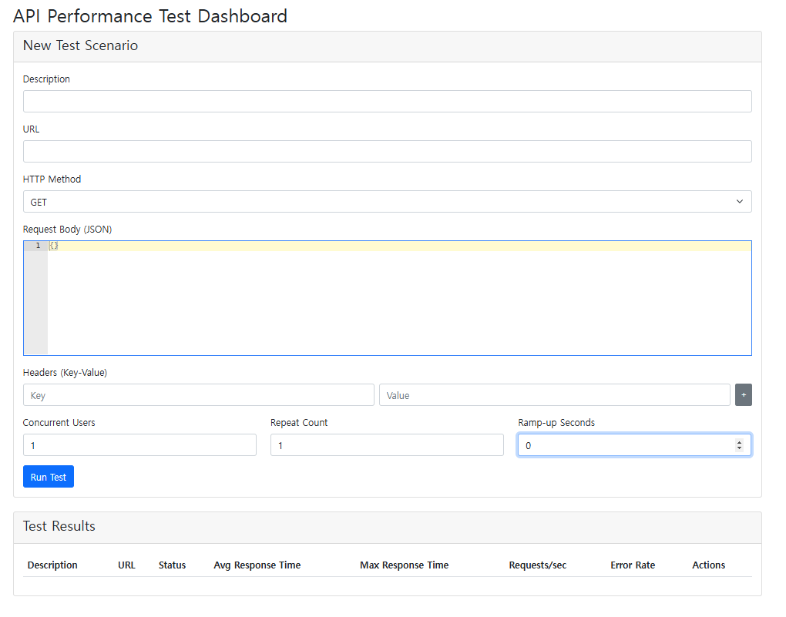

# Spring Performance Monitor

간단하게 성능 테스트와 모니터링을 위한 Spring Boot 기반의 도구입니다. API 엔드포인트의 부하 테스트를 수행하고, 메서드 수준의 성능을 모니터링할 수 있습니다.
 
A Spring Boot-based tool for simple performance testing and monitoring. It enables load testing of API endpoints and method-level performance monitoring.

## 주요 기능 (Key Features)

### 1. 부하 테스트 (Performance Testing)
- 웹 기반 대시보드를 통한 테스트 시나리오 생성 및 실행 (Create and execute test scenarios through a web-based dashboard)
- 동시 사용자 수, 반복 횟수, Ramp-up 시간 설정 가능 (Configure concurrent users, repeat count, and ramp-up time)
- HTTP 메서드(GET, POST, PUT, DELETE) 지원 (Support for HTTP methods (GET, POST, PUT, DELETE))
- 커스텀 헤더와 요청 본문 설정 가능 (Custom headers and request body configuration)
- 실시간 테스트 진행 상황 모니터링 (Real-time test progress monitoring)

#### 테스트 결과 메트릭 (Test Result Metrics)
- 평균/최대 응응답 시간 (Average/Maximum response times)
- 초당 요청 수 (Requests Per Second)
- 에러율 (Error rate)

### 2. 메서드 성능 모니터링 (Method Performance Monitoring)
- 어노테이션 기반의 간편한 메서드 성능 측정 (Easy method performance measurement using annotations)
- 실행 시간 추적 (Execution time tracking)

## 작동 원리 (How It Works)

### 부하 테스트 엔진 (Load Test Engine)
#### 핵심 컴포넌트 (Core Components)
1. RestTemplate: HTTP 요청 실행 (Executes HTTP requests)
2. ConcurrentHashMap: 테스트 결과 저장 (Stores test results)
3. ExecutorService: 동시 사용자 시뮬레이션 (Simulates concurrent users)

#### 테스트 실행 프로세스 (Test Execution Process)
1. 테스트 시나리오 접수 (Test scenario reception)
2. 각 가상 사용자별 스레드 생성 (Thread creation for each virtual user)
3. CountDownLatch로 동시성 제어 (Concurrency control using CountDownLatch)
4. 응답 시간 측정 및 결과 수집 (Response time measurement and result collection)
5. 실시간 상태 업데이트 (Real-time status updates)

## 사용 방법 (Usage)

### 1. 부하 테스트 실행하기 (Running Load Tests)
1. 애플리케이션 실행 (Start the application) - http://localhost:8080
2. 테스트 시나리오 입력 (Input test scenario)
   - Description: 테스트 설명 (Test description)
   - URL: 테스트할 엔드포인트 (Target endpoint)
   - 동시 사용자 수와 반복 횟수 설정 (Set concurrent users and repeat count)
3. Run Test 클릭 (Click Run Test)
4. 실시간 결과 확인 (Monitor real-time results)

### 2. 메서드 모니터링 추가하기 (Adding Method Monitoring)
1. 대상 메서드에 @PerformanceMeasure 추가 (Add @PerformanceMeasure to target method)
2. 어노테이션에 설명 입력 (Input description in annotation)

## 개선 포인트 (Improvement Points)

### 1. 부하 테스트 엔진 (Load Test Engine)
- Connection Pool 최적화 (Connection Pool optimization)
- 가변 부하 패턴 지원 (Variable load pattern support)
- 테스트 시나리오 재사용 (Test scenario reuse)
- 분산 테스트 지원 (Distributed testing support)

### 2. 모니터링 (Monitoring)
- 메모리 누수 탐지 (Memory leak detection)
- 상세 스레드 분석 (Detailed thread analysis)
- 커스텀 메트릭 추가 (Custom metrics addition)
- 메모리 모니터링 대시보드 (Memory Monitoring Dashboard)
- 병목 지점 시각화 (Visualize bottlenecks)

### 3. UI/UX
- 실시간 그래프 (Real-time graphs)
- 테스트 비교 기능 (Test comparison)
- 결과 내보내기 (Result export)
- 대시보드 커스터마이징 (Dashboard customization)

## Contributing

1. Fork the Project
2. Create your Feature Branch (`git checkout -b feature/AmazingFeature`)
3. Commit your Changes (`git commit -m 'Add some AmazingFeature'`)
4. Push to the Branch (`git push origin feature/AmazingFeature`)
5. Open a Pull Request

## License

This project is licensed under the MIT License - see the [LICENSE](LICENSE) file for details
